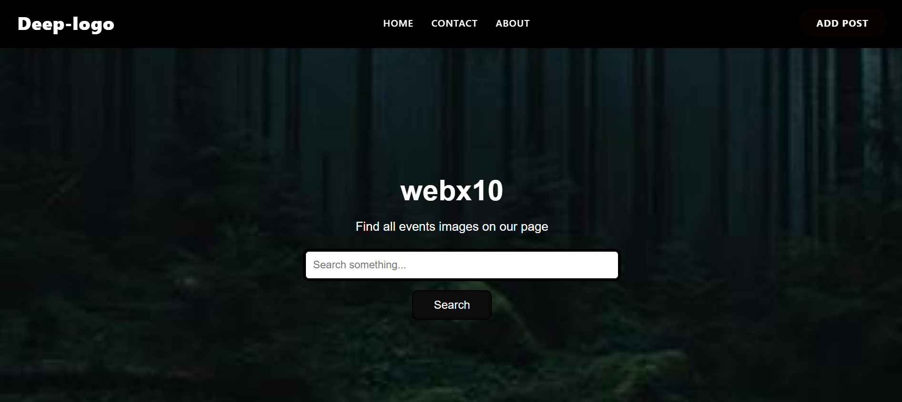
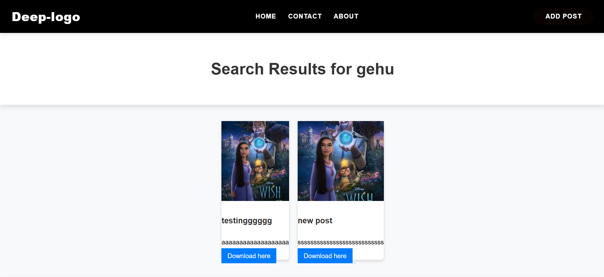
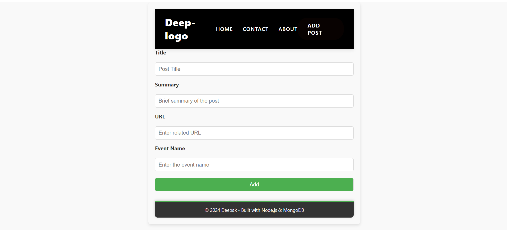
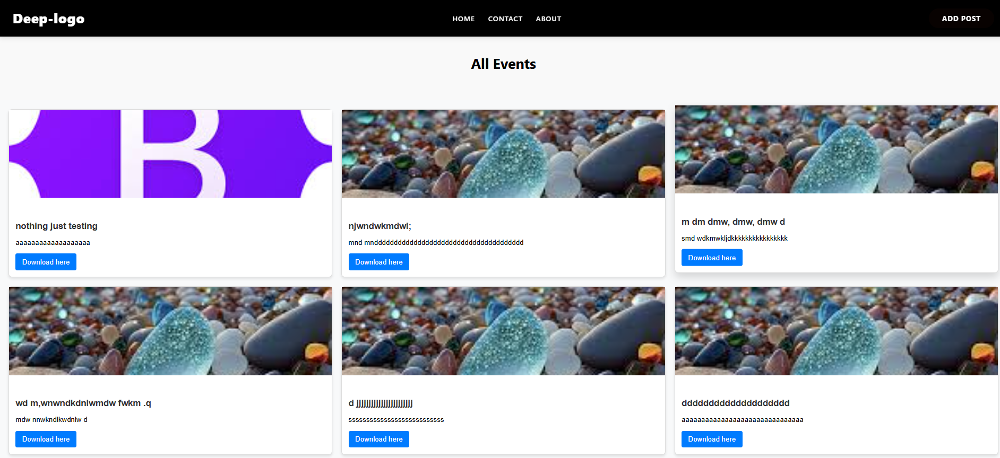
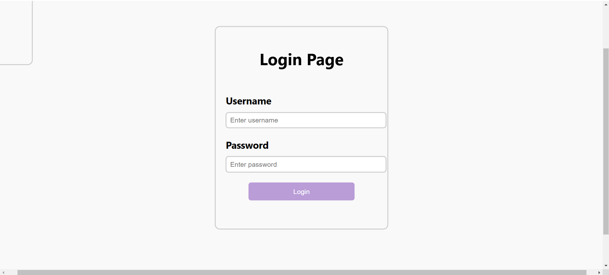

WebX10 - Image Gallery & Event Posting App
WebX10 is a dynamic web application built to allow users to view and post events. It features a responsive design with a navigation bar, event search functionality, and a form for users to add new events. The app utilizes Node.js, Express, MongoDB, and EJS to create an efficient and interactive user experience.

Features
Responsive Design: Mobile-friendly layout for easy access on any device.
Event Listing: Display event posts as interactive CSS cards with image previews.
Search Functionality: Search for events by name, and display matching results.
User Authentication: Login functionality for users to add new event posts.
Add Event Form: After logging in, users can submit event details, including title, event name, summary, and image URL.
Navigation Bar: Includes links to Home, Contact, and About pages, along with an "Add Post" button that redirects to the login page.
Technologies Used
Frontend:
HTML
CSS
JavaScript
EJS (Embedded JavaScript Templates)
Backend:
Node.js
Express.js
MongoDB (for storing event data)
Mongoose (MongoDB object modeling)
Installation
To get started with WebX10, follow the instructions below:

Clone the repository:
git clone https://github.com/deepakpandey37/image-gallery.git
Navigate to the project directory:

cd image-gallery
Install dependencies:
npm install 
Set up MongoDB:

Ensure you have MongoDB running locally or use a cloud-based service like MongoDB Atlas.

Run the development server:

npm start
Open your browser and go to http://localhost:3000 to view the app.

Usage
Homepage: When you visit the homepage, you’ll see a search bar at the top and below that, a list of event posts shown as CSS cards. You can scroll down to see more events.

Search for Events: Enter an event name in the search bar, and you will be redirected to a page with matching events displayed as CSS cards.

Add Post: Click on the "Add Post" button in the navigation bar, which will redirect you to the login page. Once logged in, you will be redirected to the "Add Event" form where you can submit your event details (title, event name, summary, image URL). After submitting, you’ll be redirected back to the homepage.

## Screenshots

### Home Page

### Event Search Page

### Add Event Form

### Cards

### Login Page

